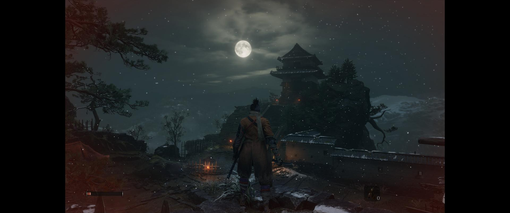

# SekiroFix
 

**SekiroFix** is an ASI plugin for **Sekiro: Shadows Die Twice** that can unlock the framerate, add ultrawide/narrower support and more.

## Features

### General
- Unlock framerate.
- Adjust gameplay FOV.
- Borderless windowed mode.
- Disable camera reset when locking on with no valid target.
- Automatically pick up enemy loot.
- Hide enemy awareness/directional detection markers.
- Hide low-health/dying and stealth vignette effects.
- Prevent Dragonrot from increasing on death.
- Disable Sen and Skill Experience death penalties.
- Log death and kill counters to text files.
- Increase Spirit Emblem capacity from prosthetic skill-tree upgrades.

### Ultrawide/Narrower
- Support for any aspect ratio.
- Unlocked windowed resolution list.
- Fixed vignettes (low health/stealth).
- Fixed animation culling at wider aspect ratios.

## Installation  
- Download the latest [release](../../../releases). 
- Extract the contents of the release zip in to the the game folder. (e.g **steamapps\common\Sekiro** for Steam)

### Steam Deck/Linux Additional Instructions
🚩**You do not need to do this if you are using Windows!**  
- Open up the game properties in your launcher and add `WINEDLLOVERRIDES="winmm=n,b" %command%` to the launch options.

## Configuration
- Open **`SekiroFix.ini`** to adjust settings.
- Set **`[Disable Camera Reset] Enabled = true`** to stop camera centering when lock-on is pressed without a target.
- Set **`[Auto Loot] Enabled = true`** to automatically pick up enemy loot.
- Set **`[Hide Awareness Markers] Enabled = true`** to hide enemy awareness/directional detection markers.
- Set **`[Hide Vignettes] Enabled = true`** to hide low-health/dying and stealth screen vignette effects. This does not hide black screens or fade transitions.
- Set **`[Prevent Dragonrot] Enabled = true`** to stop Dragonrot increasing when you die.
- Set **`[Disable Death Penalties] Enabled = true`** to stop Sen and Skill Experience loss when you die.
- Set **`[Log Stats] Enabled = true`** to write `DeathCounter.txt` and `TotalKillsCounter.txt` to the game folder every 2 seconds.
- Set **`[Spirit Emblem Upgrade] Enabled = true`** to make prosthetic skill-tree upgrades increase Spirit Emblem capacity by 1. This permanently affects save progression once the upgrade is applied.

## Screenshots
|  |
|:--------------------------:|
| Gameplay

## Credits
Original SekiroFix by **Lyall**. Additional gameplay options by **t3nka**.  
Thanks to **Hotiraripha** for commissioning this fix!  
[Ultimate ASI Loader](https://github.com/ThirteenAG/Ultimate-ASI-Loader) for ASI loading.  
[inipp](https://github.com/mcmtroffaes/inipp) for ini reading.  
[spdlog](https://github.com/gabime/spdlog) for logging.  
[safetyhook](https://github.com/cursey/safetyhook) for hooking.
